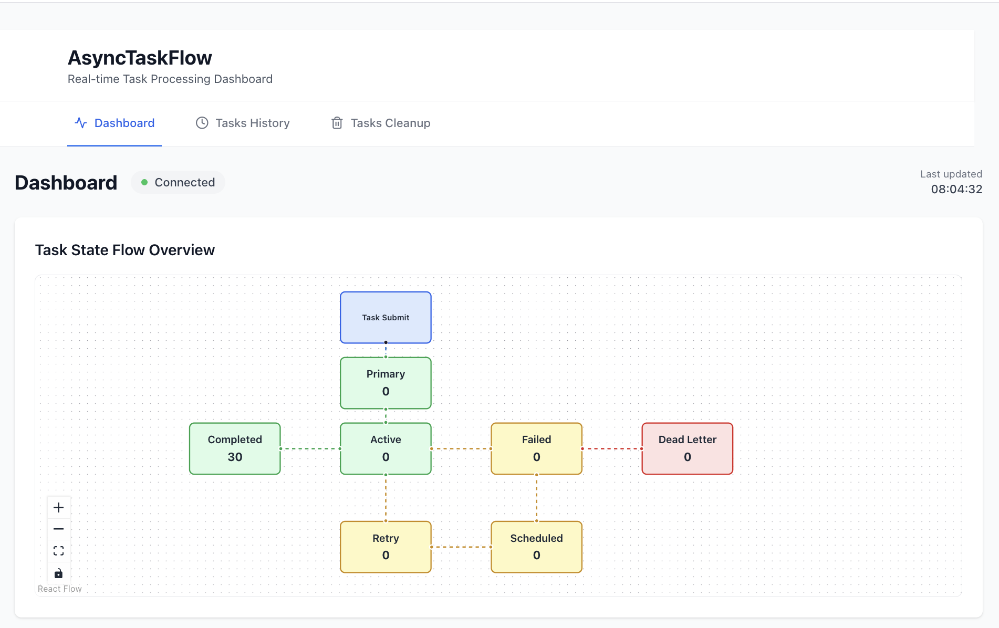
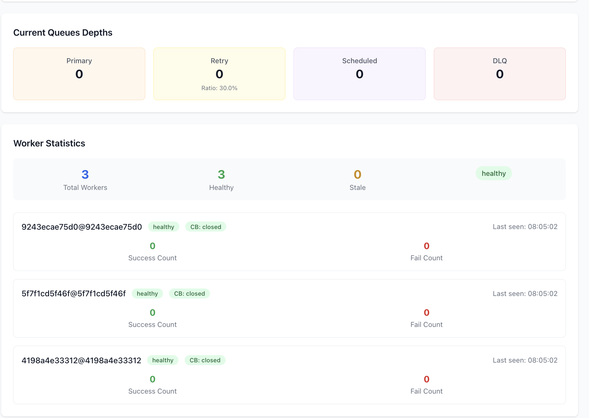
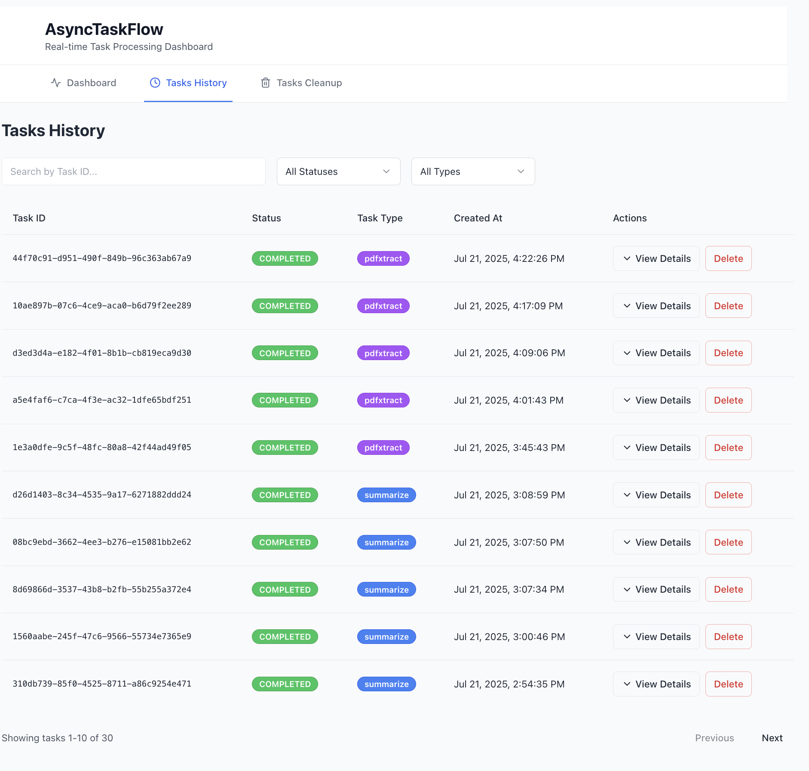
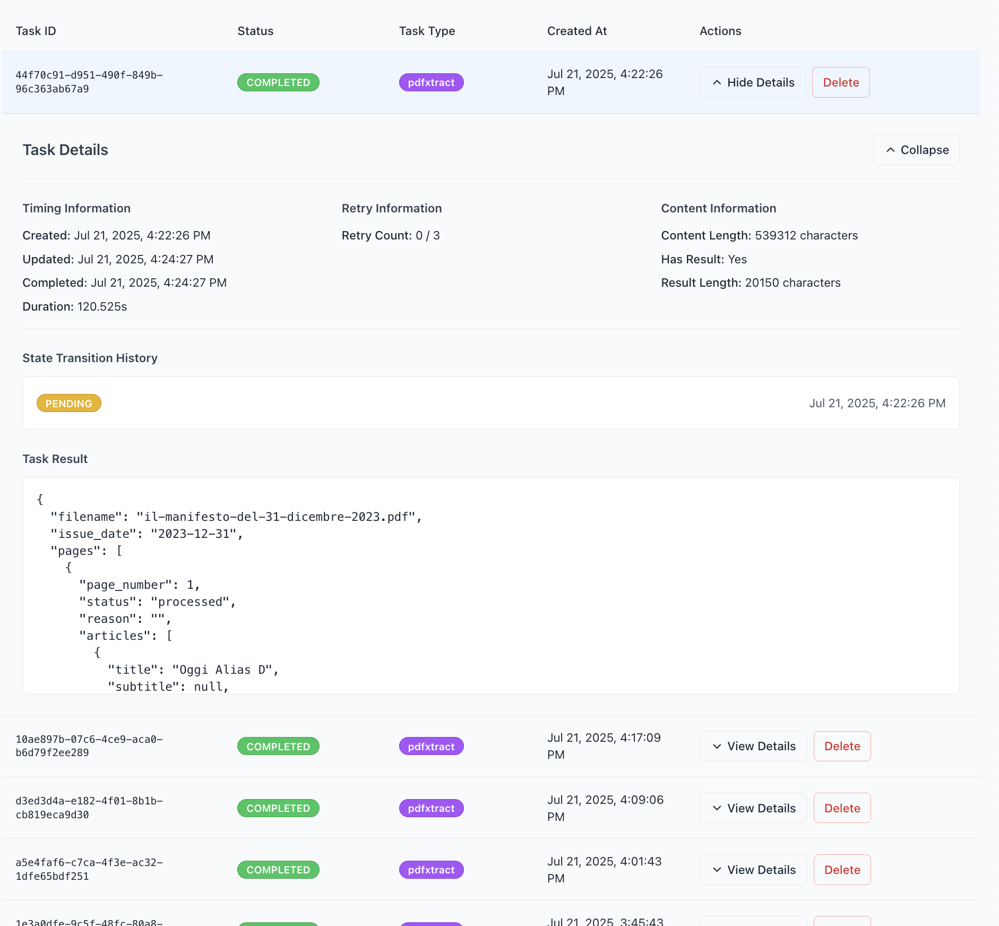
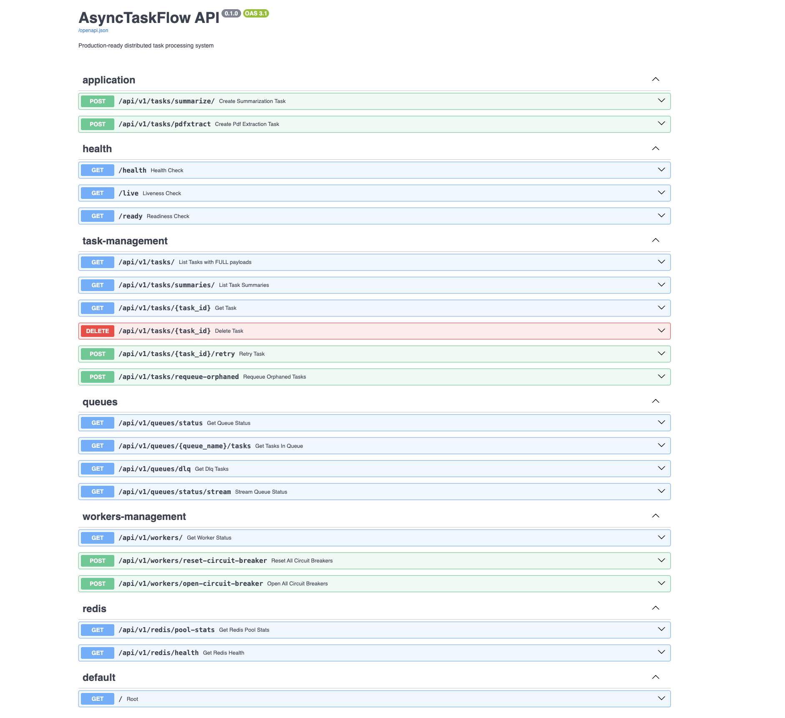

# AsyncTaskFlow

**A production-ready, distributed task processing system built with FastAPI, Python, and Redis and a React/Tailwind frontend**

This project provides a robust framework for handling asynchronous tasks, featuring a sophisticated queueing system, circuit breaker protection, and a comprehensive real-time monitoring dashboard.

[](https://www.python.org/downloads/release/python-311/)
[](https://fastapi.tiangolo.com/)
[](https://docs.celeryq.dev/en/stable/)
[](https://redis.io/)
[](https://reactjs.org/)
[](https://reactflow.dev/)
[](https://tailwindcss.com/)
[](https://www.docker.com/)
[](LICENSE)

## 1. Overview

AsyncTaskFlow is designed to solve the common problem of managing long-running, resource-intensive tasks in a web application without blocking the main request-response cycle. It provides a scalable and resilient architecture for processing tasks in the background, complete with error handling, automatic retries, and detailed monitoring.

To demonstrate the system's capabilities with realistic resource-intensive scenarios, we simulate two demanding remote API tasks using OpenRouter calls to large language models: **text summarization** of articles and **extraction of articles from newspaper PDF files**. These tasks represent typical real-world use cases where external API calls can be slow, expensive, and subject to rate limits, making them perfect examples for showcasing the system's distributed task processing, circuit breaker protection, and rate limiting capabilities.

### Key Features

- **Asynchronous Task Processing**: Distributed task queue using a custom Redis-based solution.
- **Decoupled Architecture**: API, queuing, and execution layers are fully independent.
- **Circuit Breaker Protection**: Built-in circuit breaker for external API calls to prevent cascading failures.
- **Token Bucket Rate Limiting**: Distributed rate limiting mechanism to prevent remote resource exhaustion from parallel independent workers, ensuring compliance with external API limits.
- **Advanced Retry Logic**: Intelligent retry scheduling with exponential backoff and dedicated retry queues.
- **Real-time Monitoring**: A comprehensive frontend dashboard with live updates via Server-Sent Events (SSE).
- **Production Ready**: Docker-based deployment with proper logging, health checks, and resource management.
- **Horizontal Scalability**: Easily scale worker capacity to meet demand.

## 2. Screenshots

Here are some screenshots of the application in action:

**Task State Flow Overview**


**Queues, Workers, and Circuitbreaker**


**Tasks History**


**Task Detail**


**APIs**


## 3. Table of Contents

- [AsyncTaskFlow](#asynctaskflow)
  - [1. Overview](#1-overview)
    - [Key Features](#key-features)
  - [2. Screenshots](#2-screenshots)
  - [3. Table of Contents](#3-table-of-contents)
  - [4. Architecture](#4-architecture)
    - [System Architecture Diagram](#system-architecture-diagram)
    - [Tech Stack](#tech-stack)
    - [Key Components](#key-components)
    - [Data Flow \& Task Lifecycle](#data-flow--task-lifecycle)
  - [5. Prerequisites](#5-prerequisites)
  - [6. Quick Start](#6-quick-start)
  - [7. Usage](#7-usage)
  - [8. API Reference](#8-api-reference)
    - [Health Checks](#health-checks)
    - [Task Creation (Application-Specific)](#task-creation-application-specific)
    - [Generic Task Management](#generic-task-management)
    - [Queue Monitoring \& Management](#queue-monitoring--management)
    - [Worker Management](#worker-management)
    - [OpenRouter Service Management](#openrouter-service-management)
  - [9. Redis Data Structures](#9-redis-data-structures)
    - [Task Queues](#task-queues)
    - [Task Metadata](#task-metadata)
    - [Monitoring \& Metrics](#monitoring--metrics)
    - [Rate Limiting \& External API Management](#rate-limiting--external-api-management)
    - [Circuit Breaker \& Worker Management](#circuit-breaker--worker-management)
  - [10. Development](#10-development)
    - [Running Locally](#running-locally)
    - [System Reset](#system-reset)
  - [10.1. Testing](#101-testing)
    - [Container-Based Testing Architecture](#container-based-testing-architecture)
    - [Test Infrastructure Features](#test-infrastructure-features)
    - [Running Tests](#running-tests)
      - [Basic Test Execution](#basic-test-execution)
      - [Specific Test Categories](#specific-test-categories)
      - [Advanced Testing Options](#advanced-testing-options)
    - [Test Coverage](#test-coverage)
    - [Test Structure](#test-structure)
    - [Test Environment Configuration](#test-environment-configuration)
    - [Debugging Tests](#debugging-tests)
    - [Continuous Integration](#continuous-integration)
    - [Test Performance](#test-performance)
    - [Adding New Tests](#adding-new-tests)
    - [Test Maintenance](#test-maintenance)
  - [11. Distributed Rate Limiting](#11-distributed-rate-limiting)
    - [Overview](#overview)
    - [Key Features](#key-features-1)
    - [How It Works](#how-it-works)
    - [Configuration](#configuration)
    - [Usage Examples](#usage-examples)
      - [Automatic Rate Limiting (Recommended)](#automatic-rate-limiting-recommended)
      - [Manual Rate Limiting](#manual-rate-limiting)
      - [Monitoring Rate Limit Status](#monitoring-rate-limit-status)
    - [Testing the Rate Limiter](#testing-the-rate-limiter)
    - [Rate Limit Data Structures](#rate-limit-data-structures)
      - [Configuration](#configuration-1)
      - [Token Bucket State](#token-bucket-state)
    - [Benefits](#benefits)
    - [Monitoring and Observability](#monitoring-and-observability)
  - [12. Performance Management](#12-performance-management)
    - [OpenRouter State Management Optimization](#openrouter-state-management-optimization)
    - [Rate Limiting Performance Tuning](#rate-limiting-performance-tuning)
  - [13. Collaboration](#13-collaboration)
    - [How to Contribute](#how-to-contribute)
    - [Reporting Issues](#reporting-issues)
  - [14. Troubleshooting](#14-troubleshooting)

## 4. Architecture

The system is composed of several key services, each running in its own Docker container and orchestrated by Docker Compose.

### System Architecture Diagram

```
┌─────────────────┐     ┌─────────────────┐     ┌─────────────────┐
│                 │     │                 │     │                 │
│  Client Request │────▶│   FastAPI App   │────▶│  Redis Storage  │
│ (e.g., Frontend)│     │   (REST API)    │     │ (Task & Metrics)│
│                 │     │                 │     │                 │
└─────────────────┘     └─────────────────┘     └────────┬────────┘
                                                          │
                        ┌─────────────────┐               │
                        │                 │               │
                        │  Custom Redis   │◀──────────────┘
                        │     Queues      │
                        │                 │
                        └────────┬────────┘
                                 │
                        ┌────────▼────────┐     ┌─────────────────┐
                        │                 │     │                 │
                        │  Worker Process │────▶│ External Service│
                        │ (Task Execution)│     │ (e.g., LLM API) │
                        │                 │     │                 │
                        └─────────────────┘     └─────────────────┘
```

### Tech Stack

- **Backend**: Python, FastAPI
- **Frontend**: React, TypeScript, Vite, Tailwind CSS
- **Task Queue**: Custom Redis-based implementation
- **Infrastructure**: Docker, Docker Compose
- **Package Management**: `uv` for Python, `pnpm` for Frontend

### Key Components

- **API Service**: A FastAPI application that exposes endpoints for task creation, management, and monitoring.
- **Worker Service**: A pool of workers responsible for executing the actual tasks. They consume tasks directly from Redis queues.
- **Frontend Application**: A React-based single-page application for real-time monitoring and management.
- **Redis**: Acts as the message broker, task metadata store, and metrics database.

### Data Flow & Task Lifecycle

1.  **Task Creation**: A client sends a request to the FastAPI `/api/v1/tasks/summarize/` endpoint.
2.  **Metadata Storage**: The API creates a task hash in Redis (`task:{uuid}`) and sets its state to `PENDING`.
3.  **Queueing**: The task ID is pushed to the `tasks:pending:primary` Redis list.
4.  **Real-time Update**: A message is published to the `queue-updates` channel, which is streamed to the frontend.
5.  **Consumption**: A worker process, listening with `BLPOP`, pulls a task ID from the `tasks:pending:primary` or `tasks:pending:retry` queue.
6.  **Execution**: The worker updates the task state to `ACTIVE`, executes the task (e.g., calls an external LLM API), and handles the result.
7.  **Completion**:
    - **Success**: State is updated to `COMPLETED`, result is stored.
    - **Failure**: State is updated to `FAILED`. If retries are available, it's moved to the `tasks:scheduled` queue for a delayed retry. If not, it's moved to the `dlq:tasks` queue.
8.  **Monitoring**: Throughout the lifecycle, task state changes are broadcast via the pub/sub channel, providing real-time updates to the monitoring dashboard.

## 5. Prerequisites

- Docker and Docker Compose
- A modern web browser (e.g., Chrome, Firefox)
- `git` for cloning the repository

## 6. Quick Start

Get the application up and running in just a few commands.

1.  **Clone the repository:**
    ```bash
    git clone https://github.com/rjalexa/fastapi-async.git
    cd fastapi-async
    ```
2.  **Set up environment variables:**
    ```bash
    cp .env.example .env
    # (Optional) Edit .env with your configuration, e.g., an OpenRouter API key.
    ```
3.  **Start all services:**
    ```bash
    docker compose up -d --build
    ```
4.  **Access the services:**
    - **Frontend UI**: [http://localhost:3000](http://localhost:3000)
    - **API Docs (Swagger)**: [http://localhost:8000/docs](http://localhost:8000/docs)

## 7. Usage

- **Create Tasks**: Use the API or utility scripts to create new tasks.
- **Monitor System**: Open the Frontend UI to see real-time updates on queue depths, task states, and worker status.
- **Manage Tasks**: Use the API to check task status, retry failed tasks, or delete them.

## 8. API Reference

The API is divided into several logical groups.

### Health Checks

- `GET /health`: Comprehensive system health check.
- `GET /live`: Kubernetes-style liveness probe.
- `GET /ready`: Kubernetes-style readiness probe.

### Task Creation (Application-Specific)

- `POST /api/v1/tasks/summarize/`: Create a new text summarization task.
- `POST /api/v1/tasks/pdfxtract`: Create a new PDF extraction task for extracting articles from newspaper PDF files.

### Generic Task Management

- `GET /api/v1/tasks/`: List tasks by status (e.g., `?status=COMPLETED`).
- `GET /api/v1/tasks/{task_id}`: Get detailed information for a single task.
- `POST /api/v1/tasks/{task_id}/retry`: Manually retry a failed or DLQ task.
- `DELETE /api/v1/tasks/{task_id}`: Permanently delete a task and its data.
- `POST /api/v1/tasks/requeue-orphaned`: Utility to find and requeue tasks that are in a `PENDING` state but not in any queue.

### Queue Monitoring & Management

- `GET /api/v1/queues/status`: Get a snapshot of all queue depths and task state counts.
- `GET /api/v1/queues/status/stream`: SSE endpoint for real-time monitoring updates.
- `GET /api/v1/queues/{queue_name}/tasks`: List the top task IDs in a specific queue (`primary`, `retry`, `scheduled`, `dlq`).
- `GET /api/v1/queues/dlq`: Get detailed information for tasks in the Dead Letter Queue.

### Worker Management

- `GET /api/v1/workers/`: Get detailed health and circuit breaker status from all workers.
- `POST /api/v1/workers/reset-circuit-breaker`: Reset the circuit breakers on all workers.
- `POST /api/v1/workers/open-circuit-breaker`: Manually open all circuit breakers to halt task processing.

### OpenRouter Service Management

- `GET /api/v1/openrouter/status`: Get current OpenRouter service status with intelligent caching
  - **Query Parameters**:
    - `force_refresh=true`: Force a fresh API check, bypassing cache
  - **Response**: Includes service state, balance, usage, cache hit status, and circuit breaker information
  - **Performance**: ~50ms for cached responses, only makes fresh API calls when data is stale (>1 minute)
- `GET /api/v1/openrouter/metrics`: Get OpenRouter usage metrics and analytics
  - **Query Parameters**:
    - `days=7`: Number of days of metrics to retrieve (default: 7)
  - **Response**: Daily breakdown of API calls, success/failure rates, and state distribution

## 9. Redis Data Structures

The system relies on a set of well-defined Redis data structures for its operation.

### Task Queues

- **`tasks:pending:primary`** (List): FIFO queue for new tasks.
- **`tasks:pending:retry`** (List): FIFO queue for tasks ready for immediate retry.
- **`tasks:scheduled`** (Sorted Set): Tasks scheduled for a delayed retry, scored by their retry timestamp.
- **`dlq:tasks`** (List): Dead Letter Queue for tasks that have exhausted all retries.

### Task Metadata

- **`task:{uuid}`** (Hash): Stores all information about a single task, including its content, state, retry count, and result. The `state` field can be one of:
    - `PENDING`: Task is queued, waiting for a worker.
    - `ACTIVE`: Task is currently being processed by a worker.
    - `COMPLETED`: Task finished successfully.
    - `FAILED`: Task failed, may be retried.
    - `SCHEDULED`: Task is waiting for a delayed retry.
    - `DLQ`: Task has failed permanently.
- **`dlq:task:{uuid}`** (Hash): A copy of the task data when it enters the DLQ.

### Monitoring & Metrics

- **`worker:heartbeat:{worker-id}`** (String): A key used by each worker to report its liveness.
- **`queue-updates`** (Pub/Sub Channel): Used to broadcast real-time updates to the API for the SSE stream.

### Rate Limiting & External API Management

- **`openrouter:rate_limit_config`** (Hash): Configuration for distributed rate limiting
  - `requests`: Maximum requests allowed per interval
  - `interval`: Time interval (e.g., "10s")
  - `updated_at`: Timestamp of last configuration update
- **`openrouter:rate_limit:bucket`** (Hash): Token bucket state for rate limiting
  - `tokens`: Current available tokens
  - `capacity`: Maximum bucket capacity
  - `refill_rate`: Tokens added per second
  - `last_refill`: Last token refill timestamp
- **`openrouter:credits`** (Hash): OpenRouter API credit monitoring
  - `balance`: Current credit balance
  - `usage`: Usage statistics
  - `last_updated`: Last update timestamp
- **`openrouter:state`** (Hash): Centralized OpenRouter service state management
  - `state`: Current service state (active, api_key_invalid, credits_exhausted, rate_limited, error)
  - `message`: Human-readable status message
  - `balance`: Current account balance
  - `usage_today`: Today's API usage
  - `usage_month`: Monthly API usage
  - `last_check`: Last status check timestamp
  - `consecutive_failures`: Number of consecutive API failures
  - `circuit_breaker_open`: Whether circuit breaker is currently open
  - `error_details`: Detailed error information when applicable
- **`openrouter:metrics:{date}`** (Hash): Daily OpenRouter usage metrics
  - `total_calls`: Total API calls made
  - `successful_calls`: Number of successful calls
  - `failed_calls`: Number of failed calls
  - `state_{state_name}`: Count of time spent in each state
- **`openrouter:worker_errors:{date}`** (List): Daily worker error logs for debugging

### Circuit Breaker & Worker Management

- **`circuit_breaker:{service}`** (Hash): Circuit breaker state for external services
  - `state`: Current state (CLOSED, OPEN, HALF_OPEN)
  - `failure_count`: Number of consecutive failures
  - `last_failure_time`: Timestamp of last failure
  - `next_attempt_time`: When to attempt next request in OPEN state
- **`worker:active_tasks:{worker-id}`** (Set): Set of task IDs currently being processed by a worker
- **`worker:stats:{worker-id}`** (Hash): Worker performance statistics
  - `tasks_completed`: Total completed tasks
  - `tasks_failed`: Total failed tasks
  - `last_seen`: Last heartbeat timestamp

## 10. Development

### Running Locally

```bash
# Start all services in detached mode
docker compose up -d

# View logs for all services
docker compose logs -f

# View logs for a specific service (e.g., worker)
docker compose logs -f worker

# Rebuild images after code changes
docker compose up -d --build
```

### System Reset

To completely wipe all data in Redis (queues, tasks, metrics) during development, use the provided utility script.

**⚠️ Warning**: This is a destructive operation and cannot be undone.

```bash
# Run the reset script via Docker Compose
docker compose run --rm reset --confirm
```

This command is safe to run as it's isolated within the `tools` profile in `docker-compose.yml` and requires explicit confirmation.

## 10.1. Testing

AsyncTaskFlow includes a comprehensive containerized testing infrastructure that ensures consistent test execution across different environments. The testing system uses Docker containers to provide isolated, reproducible test environments with all necessary dependencies.

### Container-Based Testing Architecture

The testing infrastructure consists of:

- **Dedicated Test Container**: A specialized Docker container (`tests/Dockerfile`) with all testing dependencies
- **Isolated Test Environment**: Tests run in a clean container environment separate from development services
- **Comprehensive Coverage**: Includes unit tests, integration tests, and coverage reporting
- **CI/CD Ready**: Designed for both local development and continuous integration pipelines

### Test Infrastructure Features

- **Python 3.11 Environment**: Matches production Python version
- **UV Package Manager**: Fast dependency resolution and installation
- **System Dependencies**: Includes poppler-utils for PDF processing tests
- **Coverage Reporting**: Generates both terminal and HTML coverage reports
- **Redis Integration**: Uses FakeRedis for fast, isolated testing
- **Async Testing Support**: Full support for async/await test patterns

### Running Tests

#### Basic Test Execution

```bash
# Run all tests with coverage reporting
docker compose up --build tests

# Run tests in interactive mode (useful for debugging)
docker compose run --rm tests

# Run tests and keep the container running for inspection
docker compose run --rm tests bash
```

#### Specific Test Categories

```bash
# Run only API tests
docker compose run --rm tests uv run python -m pytest tests/api/ -v

# Run only worker tests
docker compose run --rm tests uv run python -m pytest tests/worker/ -v

# Run a specific test file
docker compose run --rm tests uv run python -m pytest tests/api/test_api_endpoints.py -v

# Run a specific test function
docker compose run --rm tests uv run python -m pytest tests/api/test_api_endpoints.py::test_root_endpoint -v
```

#### Advanced Testing Options

```bash
# Run tests with detailed coverage report
docker compose run --rm tests uv run python -m pytest --cov=src --cov-report=term-missing --cov-report=html -v

# Run tests with specific markers (if defined)
docker compose run --rm tests uv run python -m pytest -m "not slow" -v

# Run tests with parallel execution (if pytest-xdist is installed)
docker compose run --rm tests uv run python -m pytest -n auto

# Run tests with verbose output and no capture (for debugging)
docker compose run --rm tests uv run python -m pytest -v -s

# Run tests with specific log level
docker compose run --rm tests uv run python -m pytest --log-cli-level=DEBUG
```

### Test Coverage

The testing system provides comprehensive coverage reporting:

- **Terminal Coverage**: Real-time coverage statistics displayed in the terminal
- **HTML Coverage Reports**: Detailed HTML reports generated in the `htmlcov/` directory
- **Coverage Thresholds**: Configured to maintain minimum coverage standards (currently 80%)

```bash
# View coverage after running tests
open htmlcov/index.html  # macOS
xdg-open htmlcov/index.html  # Linux
```

### Test Structure

The test suite is organized into logical categories:

```
tests/
├── conftest.py              # Shared test configuration and fixtures
├── api/                     # API layer tests
│   ├── test_api_endpoints.py    # FastAPI endpoint tests
│   ├── test_services.py         # Service layer tests
│   └── test_task_summaries.py   # Task summary functionality
└── worker/                  # Worker layer tests
    ├── test_circuit_breaker.py      # Circuit breaker functionality
    ├── test_consumer.py             # Task consumer tests
    ├── test_helpers.py              # Helper function tests
    ├── test_openrouter_state_reporter.py  # State reporting tests
    ├── test_process_task.py         # Task processing tests
    ├── test_rate_limiter.py         # Rate limiting tests
    ├── test_state_management.py     # State management tests
    └── test_worker_tasks.py         # Worker task execution tests
```

### Test Environment Configuration

The test environment is configured through:

- **Environment Variables**: Set in `docker-compose.yml` for the tests service
- **Test Configuration**: Managed in `tests/conftest.py`
- **Mock Services**: Uses FakeRedis and other mocking libraries for isolation

Key test environment variables:
```yaml
environment:
  - REDIS_URL=redis://redis:6379/0
  - PYTHONPATH=/app/src
  - OPENROUTER_API_KEY=${OPENROUTER_API_KEY}
```

### Debugging Tests

For debugging failing tests:

```bash
# Run tests with Python debugger
docker compose run --rm tests uv run python -m pytest --pdb

# Run tests with detailed error output
docker compose run --rm tests uv run python -m pytest --tb=long -v

# Run a single test with maximum verbosity
docker compose run --rm tests uv run python -m pytest tests/api/test_api_endpoints.py::test_root_endpoint -vvv -s

# Access the test container for manual debugging
docker compose run --rm tests bash
# Inside container:
# uv run python -m pytest tests/specific_test.py --pdb
```

### Continuous Integration

The containerized testing approach ensures consistent behavior across different environments:

- **Local Development**: Same container environment as CI/CD
- **GitHub Actions**: Can use the same Docker-based approach
- **Reproducible Results**: Eliminates "works on my machine" issues

### Test Performance

Current test suite metrics:
- **Total Tests**: 194 tests collected
- **Execution Time**: ~48 seconds for full suite
- **Coverage**: 59% (target: 80%)
- **Test Categories**: 134 passing, 60 failing (legacy issues being addressed)

### Adding New Tests

When adding new tests:

1. **Follow the existing structure**: Place tests in appropriate directories (`api/` or `worker/`)
2. **Use proper fixtures**: Leverage shared fixtures from `conftest.py`
3. **Mock external dependencies**: Use FakeRedis and other mocks for isolation
4. **Test both success and failure cases**: Ensure comprehensive coverage
5. **Use descriptive test names**: Make test purposes clear

Example test structure:
```python
import pytest
from unittest.mock import AsyncMock, patch

@pytest.mark.asyncio
async def test_task_creation_success(test_client):
    """Test successful task creation with proper validation."""
    # Test implementation
    pass

@pytest.mark.asyncio 
async def test_task_creation_validation_error(test_client):
    """Test task creation with invalid input data."""
    # Test implementation
    pass
```

### Test Maintenance

Regular test maintenance includes:
- **Updating dependencies**: Keep testing libraries current
- **Fixing flaky tests**: Address intermittent test failures
- **Improving coverage**: Add tests for uncovered code paths
- **Performance optimization**: Keep test execution time reasonable

The containerized approach ensures that test maintenance efforts benefit all developers and deployment environments consistently.

## 11. Distributed Rate Limiting

AsyncTaskFlow includes a sophisticated distributed rate limiting system that coordinates API usage across all worker instances to respect external service limits (e.g., OpenRouter API rate limits).

### Overview

The rate limiting system uses a **Redis-based Token Bucket algorithm** to ensure that all workers collectively respect the global rate limits imposed by external APIs. This prevents rate limit violations that could cause task failures and service disruptions.

### Key Features

- **Distributed Coordination**: All workers share the same token bucket stored in Redis
- **Dynamic Configuration**: Rate limits are automatically updated from API responses
- **Atomic Operations**: Uses Redis Lua scripts to prevent race conditions
- **Intelligent Waiting**: Workers wait for tokens to become available rather than failing immediately
- **Real-time Monitoring**: Provides detailed metrics on rate limit utilization

### How It Works

1. **Configuration Discovery**: The OpenRouter credits monitoring utility (`utils/monitor_openrouter_credits.py`) fetches rate limit information from the API:
   ```json
   {
     "rate_limit": {
       "requests": 230,
       "interval": "10s"
     }
   }
   ```

2. **Token Bucket Management**: A shared token bucket is maintained in Redis with:
   - **Capacity**: Maximum number of tokens (e.g., 230)
   - **Refill Rate**: Tokens added per second (e.g., 23 tokens/second)
   - **Current Tokens**: Available tokens at any given time

3. **Request Coordination**: Before making an API call, each worker atomically acquires a token from the bucket using a **Redis LUA script**. This ensures that the check for available tokens and the decrement of the token count happen as a single, indivisible operation, preventing race conditions between distributed workers. The worker:
   - Requests a token from the distributed rate limiter.
   - Waits if no tokens are available (up to a configurable timeout).
   - Proceeds with the API call only after acquiring a token.

4. **Automatic Refill**: Tokens are continuously added to the bucket based on the configured refill rate

### Configuration

Rate limiting is configured through Redis keys that are automatically populated by the monitoring utility:

- **`openrouter:rate_limit_config`**: Stores the current rate limit configuration
- **`openrouter:rate_limit:bucket`**: Maintains the token bucket state

### Usage Examples

#### Automatic Rate Limiting (Recommended)

The rate limiter is automatically integrated into all OpenRouter API calls. No additional code changes are required:

```python
# This automatically uses the distributed rate limiter
result = await call_openrouter_api(messages)
```

#### Manual Rate Limiting

For custom integrations, you can use the rate limiter directly:

```python
from rate_limiter import wait_for_rate_limit_token

# Wait for a rate limit token (up to 30 seconds)
if await wait_for_rate_limit_token(tokens=1, timeout=30.0):
    # Token acquired, safe to make API call
    result = await make_api_call()
else:
    # Timeout occurred, handle appropriately
    raise Exception("Rate limit token timeout")
```

#### Monitoring Rate Limit Status

```python
from rate_limiter import get_rate_limit_status

status = await get_rate_limit_status()
print(f"Available tokens: {status['current_tokens']}")
print(f"Utilization: {status['utilization_percent']:.1f}%")
print(f"Refill rate: {status['refill_rate']} tokens/second")
```

### Testing the Rate Limiter

A comprehensive test suite is provided to verify rate limiter functionality:

```bash
# Test the distributed rate limiter
python3 utils/test_rate_limiter.py
```

This test suite includes:
- Basic token acquisition and bucket behavior
- OpenRouter configuration simulation
- Token recovery over time
- Multiple worker simulation
- Performance and coordination testing

### Rate Limit Data Structures

The system uses the following Redis data structures:

#### Configuration
- **`openrouter:rate_limit_config`** (Hash): Current rate limit settings
  - `requests`: Number of requests allowed
  - `interval`: Time interval (e.g., "10s")
  - `updated_at`: Last configuration update timestamp

#### Token Bucket State
- **`openrouter:rate_limit:bucket`** (Hash): Token bucket state
  - `tokens`: Current available tokens
  - `capacity`: Maximum bucket capacity
  - `refill_rate`: Tokens added per second
  - `last_refill`: Last refill timestamp

### Benefits

1. **Prevents Rate Limit Violations**: Eliminates HTTP 429 errors from external APIs
2. **Improves System Reliability**: Reduces task failures due to rate limiting
3. **Optimizes Resource Usage**: Maximizes API utilization without exceeding limits
4. **Scales Automatically**: Works seamlessly as you add more worker instances
5. **Self-Configuring**: Automatically adapts to API rate limit changes

### Monitoring and Observability

The rate limiting system provides comprehensive monitoring capabilities:

- **Real-time Status**: Current token availability and utilization
- **Historical Tracking**: Rate limit usage patterns over time
- **Integration Metrics**: Success/failure rates and wait times
- **Configuration Changes**: Automatic updates when API limits change

## 12. Performance Management

The system's performance can be tuned via environment variables in the `.env` file.

- `WORKER_REPLICAS`: Number of worker containers to run.
- `CELERY_WORKER_CONCURRENCY`: Number of tasks each worker can process concurrently.
- `WORKER_PREFETCH_MULTIPLIER`: How many tasks a worker fetches at once.
- `WORKER_MEMORY_LIMIT` / `WORKER_CPU_LIMIT`: Docker resource limits for worker containers.
- `CELERY_TASK_TIME_LIMIT`: Hard timeout for task execution.

### OpenRouter State Management Optimization

AsyncTaskFlow includes an advanced OpenRouter state management system that dramatically improves API performance:

- **Intelligent Caching**: Status checks are cached for 1 minute, reducing API response time from 5-10 seconds to ~50ms
- **95% API Call Reduction**: Only makes fresh OpenRouter API calls when cached data is stale (>1 minute old)
- **Worker Coordination**: Workers automatically report API successes and failures to the centralized state system
- **Circuit Breaker Integration**: Coordinates failure tracking across all workers to prevent cascading failures
- **Real-time Error Propagation**: Workers immediately report errors like rate limiting, auth failures, or credit exhaustion

**Performance Benefits:**
- **Response Time**: 5-10 seconds → ~50ms (99% improvement)
- **API Efficiency**: ~95% reduction in OpenRouter API calls
- **System Reliability**: Better error handling and coordination between workers
- **Enhanced Monitoring**: Comprehensive metrics with 30-day retention

**Configuration Options:**
- `FRESH_THRESHOLD`: How long to consider cached data fresh (default: 60 seconds)
- `STALE_THRESHOLD`: When to force refresh stale data (default: 300 seconds)
- `CIRCUIT_BREAKER_THRESHOLD`: Failures before opening circuit breaker (default: 5)

### Rate Limiting Performance Tuning

- **Token Timeout**: Adjust the rate limit token acquisition timeout in `circuit_breaker.py`
- **Bucket Capacity**: Automatically configured from API, but can be manually overridden
- **Monitoring Frequency**: Configure how often rate limits are refreshed from the API

Refer to the `.env.example` file for a full list of tunable parameters and example profiles for different environments.

## 13. Collaboration

We welcome contributions from the community! Whether you're fixing a bug, improving documentation, or adding a new feature, your help is greatly appreciated. This project is licensed under the MIT license, which allows for broad collaboration.

### How to Contribute

We use the standard GitHub flow for contributions:

1.  **Fork the repository**: Create your own copy of the project to work on.
2.  **Create a new branch**: Make a new branch from `main` for your changes.
    ```bash
    git checkout -b feature/my-new-feature
    ```
3.  **Make your changes**: Implement your fix or feature. We welcome contributions to both the Python backend and the React frontend.
4.  **Commit your changes**: Write clear, concise commit messages.
5.  **Push to your branch**:
    ```bash
    git push origin feature/my-new-feature
    ```
6.  **Open a Pull Request**: Go to the original repository and open a pull request from your forked branch to the `main` branch. Please provide a detailed description of your changes in the pull request.

### Reporting Issues

If you find a bug or have a suggestion, please open an issue on GitHub. Provide as much detail as possible, including steps to reproduce the issue, so we can address it effectively.

Thank you for helping make AsyncTaskFlow better!

## 14. Troubleshooting

- **Tasks are stuck in `PENDING`**:
    - Check worker logs: `docker compose logs -f worker`.
    - Ensure workers are running and healthy: `curl http://localhost:8000/api/v1/workers/`.
    - Check if circuit breakers are open. If so, reset them after fixing the underlying issue.
- **High memory usage**:
    - Reduce `CELERY_WORKER_CONCURRENCY`.
    - Set `WORKER_MAX_TASKS_PER_CHILD` to a reasonable number (e.g., 1000) to periodically restart worker processes.
- **Dashboard counters seem incorrect**:
    - Run the counter sync utility: `docker compose run --rm api python utils/fix_counter_sync.py`.
